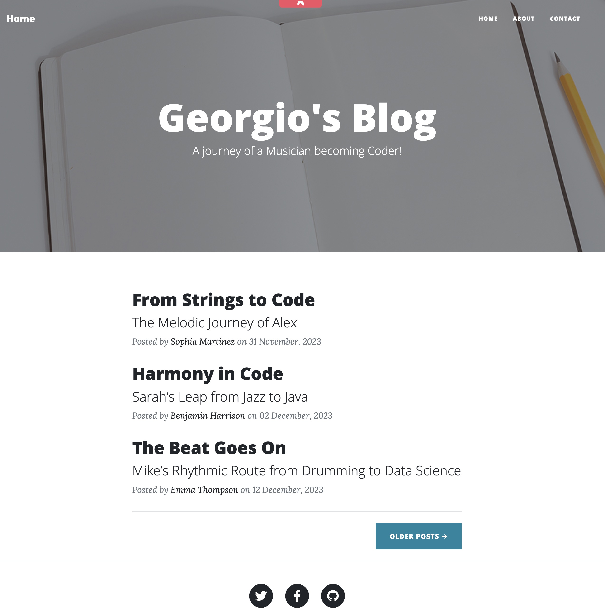
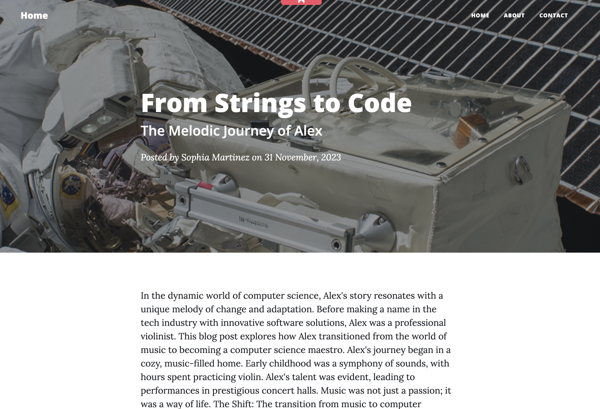

# Georgio's Blog

## Overview
Georgio's Blog is a Flask-based web application designed for a musician-turned-coder to share his journey and experiences. The blog features a clean, responsive design and is equipped with a navigation bar, dynamic content loading, and a contact form.

## Pages

### Home Page (`index.html`)
- Features a large header with a background image, displaying the blog's title and a descriptive subtitle.
- Lists blog posts dynamically loaded from an external API.
- Each post preview includes the title, subtitle, author, date, and a link to the full post.
- Includes a "Load More" button for pagination.

### About Page (`about.html`)
- Presents information about the blog or the author.
- Styled with a unique background image in the header.
- Contains rich text about the author's journey and motivations.

### Contact Page (`contact.html`)
- Allows visitors to contact the author.
- Includes a form for visitors to fill out, including fields for name, email, phone, and message.
- Form integrated with an external service for submission handling.

### Post Page (`post.html`)
- Displays the content of an individual blog post.
- Includes the post's title, subtitle, author, and date in the header.
- The main body of the post is presented in a clean, readable format.

## Common Elements

### Header (`header.html`)
- Consistent across all pages.
- Contains the navigation bar with links to Home, About, and Contact pages.
- Responsive design for various screen sizes.

### Footer (`footer.html`)
- Uniform footer across all pages.
- Provides social media links and copyright information.

## Technologies Used
- Flask (Python web framework)
- Bootstrap (Front-end framework)
- Font Awesome (Icon toolkit)
- Google Fonts

## Installation & Usage

1. Clone the Repository (if applicable)
- If the application is hosted in a Git repository, first clone it to your local machine:

    `git clone https://github.com/georgiosKachrimanis/small_apps`

    `cd blogging`

2. Create a Virtual Environment
It's a good practice to create a virtual environment for Python projects. This keeps dependencies required by different projects separate and organized. In the root directory of the project, run:

    `python -m venv venv`

    To activate the virtual environment, run:

    On Windows: `venv\Scripts\activate`

    On macOS and Linux: `source venv/bin/activate`

3. Install Dependencies
Install the required packages (like Flask) using pip. This usually involves installing from a requirements.txt file:

    `pip install -r requirements.txt`

4. Set Environment Variables
Before running the application, you need to set the FLASK_APP environment variable to tell Flask how to load the application:

`export FLASK_APP=app.py`

On Windows, use set instead of export.

5. Run the Application
Start the Flask application with the following command:

`flask run`

This will start a local web server. By default, it will be accessible at http://localhost:8000/.

6. Access the Application
Open your web browser and go to http://localhost:8000/. You should see the homepage of your Flask application.

Notes:
Make sure to replace app.py with the actual entry file of your Flask application if it's named differently.
If there are additional setup steps specific to your application (like setting up a database), make sure to include those as well.

## Credits
Theme Downloaded from [Start Bootstrap](https://startbootstrap.com/previews/clean-blog) 

Developed by Georgios Kachrimanis, a musician and aspiring coder.

## License

This project is licensed under the MIT License.

For the full text of the license, refer to the [MIT License](https://opensource.org/licenses/MIT).

-----------
> Note: This application is for educational purposes only. Always ensure compliance with the APIs' terms of use and avoid sharing sensitive personal information.

